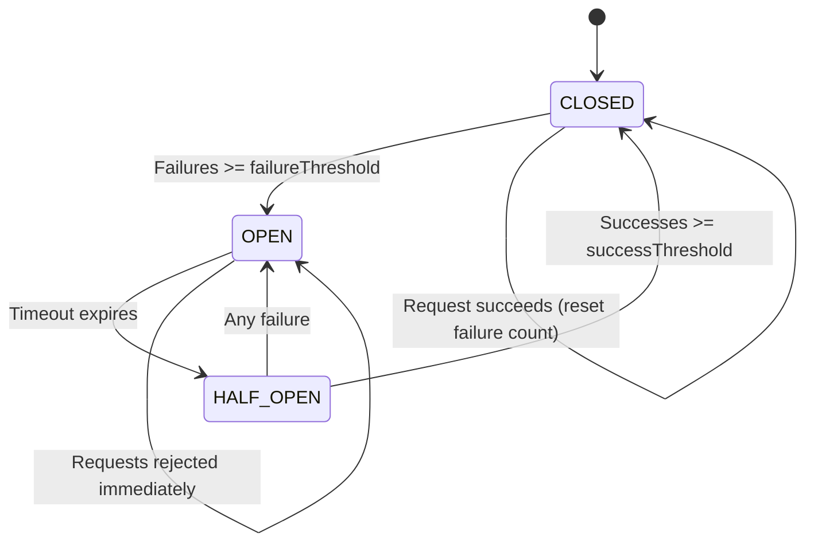

# Circuit Breaker Pattern Guide

> Prevents cascading failures when external dependencies fail.

---

## 🎯 Purpose

When an external service (Supabase, payment API, email service) starts failing:
- **Without Circuit Breaker**: Requests pile up, timeouts cascade, system grinds to a halt
- **With Circuit Breaker**: Fails fast after threshold, gives dependency time to recover

---

## 📊 State Diagram



### ASCII Diagram (for terminals)

```
                         ┌──────────────┐
                         │              │
      ┌─────────────────▶│    CLOSED    │◀─────────────────┐
      │                  │  (Normal)    │                  │
      │                  └──────┬───────┘                  │
      │                         │                          │
      │            Failures >= failureThreshold            │
      │                         │                          │
      │                         ▼                          │
      │                  ┌──────────────┐                  │
      │                  │              │                  │
      │                  │     OPEN     │                  │
      │                  │  (Failing    │                  │
      │                  │   Fast)      │                  │
      │                  └──────┬───────┘                  │
      │                         │                          │
      │              Timeout expired                       │
      │                         │                          │
      │                         ▼                          │
      │                  ┌──────────────┐                  │
  Successes >=           │              │        Failure   │
  successThreshold       │  HALF_OPEN   │──────────────────┘
      │                  │  (Testing)   │     (Back to OPEN)
      │                  └──────────────┘
      │                         │
      └─────────────────────────┘
```

---

## 🔧 Configuration Options

| Option | Default | Description |
|--------|---------|-------------|
| `failureThreshold` | 5 | Consecutive failures before opening circuit |
| `successThreshold` | 2 | Successes in HALF_OPEN before closing |
| `timeout` | 30000ms | Time to stay OPEN before testing recovery |
| `requestTimeout` | 10000ms | Timeout for individual requests |

---

## 📌 State Behavior

### CLOSED (Normal Operation)
- ✅ All requests pass through
- 📊 Failures are counted
- ⚠️ Success resets failure count
- 🔴 Opens when `failures >= failureThreshold`

### OPEN (Failing Fast)
- ❌ All requests immediately rejected with `CircuitOpenError`
- ⏱️ Timer starts for `timeout` duration
- 🔄 Transitions to HALF_OPEN when timeout expires

### HALF_OPEN (Testing Recovery)
- 🧪 Limited requests allowed through
- ✅ Success increments success count
- 🟢 Closes when `successes >= successThreshold`
- 🔴 Any failure immediately reopens circuit

---

## ✅ Usage Examples

### Basic Usage

```javascript
import { getCircuit, CircuitOpenError } from './src/utils/circuit-breaker.js';

// Get or create a circuit breaker
const supabaseCircuit = getCircuit('supabase', {
  failureThreshold: 5,
  timeout: 30000
});

// Execute a query through the circuit breaker
async function fetchUsers() {
  try {
    return await supabaseCircuit.execute(async () => {
      const { data, error } = await supabase.from('users').select();
      if (error) throw error;
      return data;
    });
  } catch (err) {
    if (err instanceof CircuitOpenError) {
      // Circuit is open - fail fast
      console.error(`Service unavailable, retry in ${err.nextRetry}ms`);
      return []; // Return cached/default data
    }
    throw err; // Rethrow other errors
  }
}
```

### With Fallback

```javascript
async function getInvoiceWithFallback(invoiceId) {
  const circuit = getCircuit('supabase');

  try {
    return await circuit.execute(() => fetchInvoiceFromDB(invoiceId));
  } catch (err) {
    if (err instanceof CircuitOpenError) {
      // Return cached data when circuit is open
      return getCachedInvoice(invoiceId);
    }
    throw err;
  }
}
```

### Multiple Circuits

```javascript
// Different circuits for different services
const circuits = {
  supabase: getCircuit('supabase', { failureThreshold: 5 }),
  payment: getCircuit('payment-api', { failureThreshold: 3, timeout: 60000 }),
  email: getCircuit('email-service', { failureThreshold: 10 })
};

// Check all circuit statuses
import { getAllCircuitStatuses } from './src/utils/circuit-breaker.js';

app.get('/admin/circuits', (req, res) => {
  res.json(getAllCircuitStatuses());
});
```

---

## 📊 Metrics & Monitoring

Each circuit tracks:

```javascript
{
  name: 'supabase',
  state: 'CLOSED',
  failureCount: 2,
  successCount: 0,
  nextAttempt: null,
  metrics: {
    totalRequests: 1523,
    successfulRequests: 1498,
    failedRequests: 25,
    rejectedRequests: 0,
    lastSuccess: '2025-12-25T12:00:00.000Z',
    lastFailure: '2025-12-25T11:45:00.000Z'
  },
  config: {
    failureThreshold: 5,
    successThreshold: 2,
    timeout: 30000,
    requestTimeout: 10000
  }
}
```

### Health Check Integration

```javascript
import { registerHealthCheck } from './src/utils/health.js';
import { getCircuit, CircuitState } from './src/utils/circuit-breaker.js';

// Register circuit status as health check
registerHealthCheck('supabase', async () => {
  const circuit = getCircuit('supabase');
  return {
    healthy: circuit.state !== CircuitState.OPEN,
    message: circuit.state === CircuitState.OPEN
      ? 'Circuit breaker open'
      : 'Circuit breaker closed'
  };
});
```

---

## ⚠️ When to Use

### ✅ Good Use Cases
- Database queries (Supabase, PostgreSQL)
- External API calls (payment, email, SMS)
- Third-party integrations
- Microservice communication

### ❌ Not Needed For
- In-memory operations
- Static file serving
- Simple computations
- Operations that must succeed or fail (no fallback)

---

## 🔍 Debugging

### Check Circuit Status

```javascript
import { getAllCircuitStatuses, resetAllCircuits } from './src/utils/circuit-breaker.js';

// View all circuit statuses
console.log(getAllCircuitStatuses());

// Reset all circuits (useful in development)
resetAllCircuits();
```

### Logs to Watch

```json
{"level":"WARN","message":"Circuit failure recorded","circuit":"supabase","failureCount":4,"threshold":5}
{"level":"ERROR","message":"Circuit opened","circuit":"supabase","state":"OPEN","nextAttempt":"2025-12-25T12:01:00.000Z"}
{"level":"INFO","message":"Circuit half-open, testing recovery","circuit":"supabase","state":"HALF_OPEN"}
{"level":"INFO","message":"Circuit closed","circuit":"supabase","previousState":"HALF_OPEN","state":"CLOSED"}
```

---

## 📌 Summary

| State | Behavior | Transition |
|-------|----------|------------|
| **CLOSED** | Normal operation | → OPEN on 5 failures |
| **OPEN** | Reject all requests | → HALF_OPEN after 30s |
| **HALF_OPEN** | Test requests | → CLOSED on 2 successes, → OPEN on any failure |

The circuit breaker is your **first line of defense** against cascading failures. It's lightweight when things are working, but becomes "life-saving medicine" when dependencies start failing.
